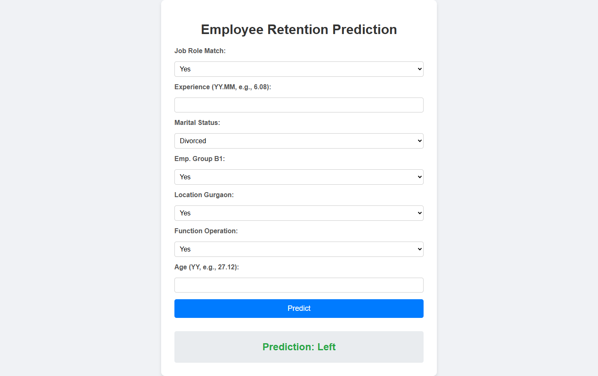

# Employee Turnover Forecasting App

This is a FastAPI web application that predicts whether an employee will stay or leave based on input features like job role match, experience, marital status, employee group, location, function, and age. The app uses a pre-trained CatBoost model and provides a user-friendly interface with dropdowns for categorical inputs and numeric fields for continuous inputs. Predictions are displayed cleanly without input data, as specified.



## Features
- **User-Friendly Interface**: A modern web form with dropdowns for categorical inputs ("Yes"/"No" for binary fields, "Div.", "Marr.", etc. for marital status) and numeric inputs for experience and age.
- **Robust Input Handling**: Accepts string inputs, validates them, and maps them to numeric values for the CatBoost model.
- **Error Handling**: Displays user-friendly error messages for invalid inputs.
- **Beautiful Design**: Styled with a clean, responsive CSS layout.
- **Deployable**: Ready for deployment on platforms like Render, Heroku, or AWS.

## Project Structure
```
project/
├── main.py                 # FastAPI application code
├── templates/
│   └── index.html          # HTML template for the web interface
├── static/
│   └── style.css           # CSS for styling the interface
├── model/
│   └── catboost_model.pkl  # Pre-trained CatBoost model
├── requirements.txt        # Python dependencies

```


## Prerequisites
- Python 3.8+
- pip (Python package manager)
- Git (optional, for deployment)

## Setup Instructions

1. **Clone the Repository** (if using Git):
   ```
   git clone https://github.com/jarif87/employee-turnover-forecasting.git
   ```
2. **Create a Virtual Environment:**
```
python -m venv venv
source venv/bin/activate  # On Windows: venv\Scripts\activate
```
3. **Install Dependencies:**
```
pip install -r requirements.txt
```
### Running Locally

- Start the FastAPI Server

```
uvicorn main:app 

```
### Access the App:
- Open your browser and go to http://127.0.0.1:8000.
- Use the form to input:Job Role Match: Select "Yes" or "No".
    - Experience: Enter years in YY.MM format (e.g., 6.08).
    - Marital Status: Select "Div.", "Marr.", "NTBD", "Sep.", or "Single".
    - Emp. Group B1: Select "Yes" or "No".
    - Location Gurgaon: Select "Yes" or "No".
    - Function Operation: Select "Yes" or "No".
    - Age: Enter age in YY format (e.g., 27.12).

- Click "Predict" to see the result ("Stay" or "Left").

### Dependencies

```
catboost==1.2.8
fastapi==0.115.13
numpy==1.26.4
pandas==2.2.3
pydantic==2.11.7
uvicorn
jinja2
python-multipart
```
